# fast26_specfs_slides


### Sharpen the Spec, Cut the Code:

### A Case for Generative File System with SYSSPEC

**Qingyuan Liu**, Mo Zou, Hengbin Zhang, Dong Du, Yubin Xia, Haibo Chen **IPADS · Shanghai Jiao Tong University**

<!-- Page 2 -->

## File System Keeps Evolving


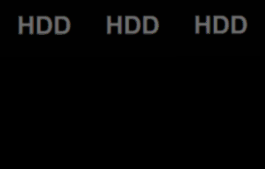

**HDD** **Ext4** **File systems for new hardware**

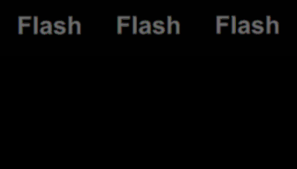

**F2FS** **Flash**


**File systems for new application**

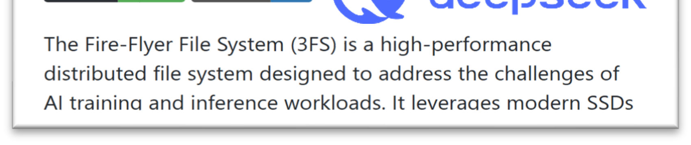

*Delayed allocation* **…** *Inline data* *journal checksums* *Metadata* *Fast commit* *extent* *checksums* **Mature file systems keep evolving** **…** **2020** **…** **2026** **…** **2006** **2008** **2012** **2013** 2

<!-- Page 3 -->

## The Effort of File System Dev/Evo

*From Linux 2.6.19 to 6.15: ~ 3,157 ext4-related commits* ***Feature: 5.1% commits → 18.4% Lines of code*

- 

Efforts on new features:**extensive coding** 3

<!-- Page 4 -->

## The Effort of File System Dev/Evo

*From Linux 2.6.19 to 6.15: ~ 3,157 ext4-related commits* *Bug fixing & Maintenance: 82.4% of commits*

- 

Efforts on**long tail**maintenance and bug fixing 4

<!-- Page 5 -->

## Rapid Advancement of LLM Coding

**Reduce the efforts for file system Dev/Evo using the LLM?** 5

<!-- Page 6 -->

## Our Vision: Generative File System

**Implementations** **Specifications**


Module B Module A


***Design*** ***Code***

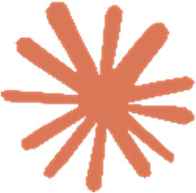

Module C LLM & Agent Programmer **Write the file system with specifications** **Leave the coding to LLMs** 6

<!-- Page 7 -->

## Our Vision: Generative File System

**Implementations** **Specifications** Module B Module A ***Update*** ***Update***


Module C Module D LLM & Agent Programmer **Update the specifications to evolve the file system** 7

<!-- Page 8 -->

## Challenges for Generative File System

***Challenge IV*** ***3. Generate from spec→code*** ***Challenge I & II*** ***1. Specify the FS***


Module B Module A


Design Code

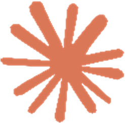

Module C

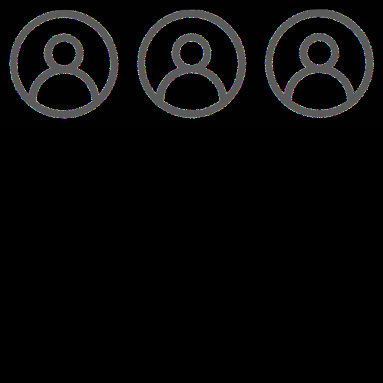

Module B Module A


Update Update


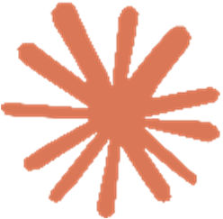

Module C Module D LLM & Agent ***2. Update the spec*** ***Challenge III*** **At least four challenges to achieving robust code generation** 8

<!-- Page 9 -->

## Challenges for Generative File System

- 

**Challenge I: Semantic Gaps** – Lacking a systematic methodology for specifying the**functionality**of programs *(Including sequential and concurrent logic)* “Help me generate a file system” ???


– “No dependency error” – “Avoid race conditions with locking” – …… 9

<!-- Page 10 -->

## Challenges for Generative File System

- 

**Challenge II: Complicated Component Composition** ***Context Exceeded!*** ***(generate ~200 lines of*** ***One-pass generation*** ***C code → ~30k tokens)*** Module A Module E


Module B Module C Module D ***Multi-pass generation*** ***Dependency Errors!*** Module A Module E


Module B Module C Module D *1**st* *pass* *2**nd* *pass* *Interface mismatch* 10

<!-- Page 11 -->

## Challenges for Generative File System

- 

**Challenge III: Backward Compatibility** – How to avoid cascading dependency issues after specification updates?

Module A Module E **Original** **Specifications** Module B Module C Module D *Update* Module A Module E *Dependency errors* **New** **Specifications** Module B New C Module D 11

<!-- Page 12 -->

## Challenges for Generative File System

- 

**Challenge IV: Unreliable LLM Capability** – How to reduce hallucinations and enhance the stability of code generation?

int atomfs_write(char* path[], const char* buf, unsigned size, unsigned offset) { // ERROR: Hallucinated safe state. Forgot lock(root_inum);

struct inode *inum = locate(root_inum, path);

if (inum == NULL) return -1;

***Occasionally happens*** int res = check_file(inum);

if (res == 1) return -1;

int ret = inode_write(inum, buf, size, offset);

unlock(inum);

return ret;

} 12

<!-- Page 13 -->

## Challenges for Generative File System

***Challenge IV*** ***3. Generate from spec→code*** ***Challenge I & II*** ***1. Specify the FS*** Module B Module A Design Code Module C Module B Module A Update Update Module C Module D LLM & Agent ***2. Update the spec*** ***Challenge III*** 13

<!-- Page 14 -->

## SysSpec: Design Overview

- 

***Design I: SysSpec Specification***

- 

***Design III: SysSpec Toolchain*** – *Addressing Challenge I & II* – *Addressing Challenge IV* Module B Module A Design Code Module C Module B Module A Update Update Module C Module D LLM & Agent

- 

***Design II: Spec Patch*** – *Addressing Challenge III* 14

<!-- Page 15 -->

## SysSpec Specification: Key Insight

***Generative File System*** Implementations Module B Module A Design Code Module C **Generate non-existence Impl with Spec** ***Formal Verification*** Implementations Specifications


Module B Module A Implement Module C Verify **Verify existence Impl with Spec** 15

<!-- Page 16 -->

## SysSpec Specification: Key Insight

***Generative File System*** Implementations Module B Module A Design Code Module C **Generate, rather than Verify** ***Formal Verification*** Implementations Specifications Module B Module A Implement Module C Verify **Borrow methodologies from formal verification** 16

<!-- Page 17 -->

## SysSpec Specification: Basic Unit

**SpecFS** **ImpFS** **Impl Module C** **Spec Module C** **Impl Module A** **Impl Module B** **Spec Module A** **Spec Module B** **Module: basic unit of specification and code generation** 17

<!-- Page 18 -->

## SysSpec Specification Structure

**SysSpec** **Spec Module A** **Specification** **Concurrency** **Modularity** **Functionality** **Specification** **Specification** **Specification** **SysSpec Specification: consists of 3 types of specifications** 18

<!-- Page 19 -->

## SysSpec Specification Structure

- 

**Functionality Specification** – Define sequential functionality of each module.

Address Challenge I

- 

**Concurrency Specification** – Specify concurrent behavior and interactions.

- 

**Modularity Specification** Address Challenge II – Describe inter-module composition and dependencies.

19

<!-- Page 20 -->

## Functionality Specification

**Hoare Style Specification** [Pre-condition]:

[Pre-condition] path: a NULL-terminated string array Required state before execution name: a valid string [Post-condition] Case 1 Successful traversal and insertion [Post-conditon]:

```
- New inode created
- Entry inserted into target directory
```

Guaranteed state upon completion

```
- Return 0
```

Case 2 Traversal or insertion failure Return -1 [Invariants]:

[Invariants] properties that must hold true The root inum always exists across state transitions ***Functionality Specification of***atomfs_ins **Borrow Hoare logic from formal verification** 20 ***Optional Semantics of Intent & System Algorithm: details in the paper***

<!-- Page 21 -->

## Concurrency Specification

[Locking Specification of locate] Pre-condition: cur is locked.

Post-condition: suppose return target.

```
- If target is NULL: no lock owned
- If target is not NULL: only target is owned
```

The state of locking of [Locking Specifications of check_ins] each function call …… [Locking Specification of atomfs_ins] …… ***Concurrency Specification of***atomfs_ins **Focus on concurrent behavior** 21

<!-- Page 22 -->

## Modularity Specification

**Constrained module sizes: typically <500 LoC** [Rely] struct inode {…};

[Rely]:

struct inode* root_inum;

Predefined external void lock(struct inode*);

dependencies void unlock(struct inode*);

struct inode* locate(struct inode* cur, char* path[]); // Traverse path under cur void insert(struct inode*, struct inode*, char*) // … [Guarantee]:

[Guarantee] Behavior guaranteed int atomfs_ins(char*[], char*, int, unsigned, unsigned) by the implementation ***Modularity Specification of***atomfs_ins **Borrow the rely/guarantee from formal verification** 22

<!-- Page 23 -->

**Inherent Dependencies through Modularity Specification** **Spec Module A** **Spec Module B** *“Module B relies on Module A’s guarantee”* **Module A** **Module E** **Module B** **Module C** **Module D** **Construct SpecFS with DAG-structured dependencies** 23

<!-- Page 24 -->

## Spec Patch: From Construction to Evolution

Module B Module A Design Code Module C Module B Module A Update Update Module C Module D LLM & Agent ***Design II: Spec Patch*** 24

<!-- Page 25 -->

## From Construction to Evolution

- 

**The DAG structure of specifications is natural for evolution**

- 

**Organize new/modified specifications using DAG**

- Merge into original specifications**atomically**

Inode & extent data inode Example: part of the spec structure read/write read/write patch implementingExtent **Root Node:** **Non-root Node:** Rely on newguaranteesbut Implement newguarantees itsguaranteesdo not change

<!-- Page 26 -->

## Evolution Process: Spec Patch Merging

Module B ***Root Node*** inode inode Module A read/write read/write data inode & extent data read/write structure read/write **Spec Patch** **Original Spec** 26

<!-- Page 27 -->

## Evolution Process: Spec Patch Merging

Module B ***Root Node*** inode Module A read/write inode read/write data inode & extent read/write structure data read/write 27

<!-- Page 28 -->

## Evolution Process: Spec Patch Merging

Module B Achieve**atomic**system evolution Mitigate cascading dependency issues inode Module A read/write data inode & extent read/write structure **Merged Spec** 28

<!-- Page 29 -->

**SysSpec Toolchain: From Specification to Implementation** ***Design III: SysSpec Toolchain*** Module B Module A Design Code Module C Module B Module A Update Update Module C Module D LLM & Agent 29

<!-- Page 30 -->

## From Specification to Implementation


***generate*** Spec Module A **SpecCompiler** ***retry with feedbacks*** Impl v1 feedbacks


**SpecValidator** ***validate*** **Retry-with-feedback loops** ***(~30% modules retry at least once )*** 30 ***SpecAssistant: assisting developers in generating specifications; details in the paper***

<!-- Page 31 -->

**Case Study: The Generation and Evolution of SpecFS**

- 

**SpecFS: a concurrent file system generated from scratch**

- Modeled after**AtomFS [SOSP’19]**
- 

**System Evolution: Add 10 ext4 features to original SpecFS**

- Together: ~4k LoC, ranked 42/82 in Linux 6.1.10

<!-- Page 32 -->


## Evaluation: Functional Correctness

- 

**Definition of *Correct *:** – Logically equivalent to AtomFS through manual inspection and passes all tests

|LLM|AtomFS|Features|
|---|---|---|
|Gemini-2.5/3.0-pro|_100% (45/45)_|_100% (70/70)_|
|Deepseek-V3.1|_100% (45/45)_|_100% (70/70)_|
|GPT-5-minimal|_100% (45/45)_|_100% (70/70)_|
|Qwen3.5-397B-A17B|_100% (45/45)_|_100% (70/70)_|
|Qwen3-32B|_82.2% (37/45)_|_92.9% (65/70)_|

*Errors mainly* *results from* *concurrency* **Show equivalent level of correctness as human-written AtomFS** 32

<!-- Page 33 -->

## Evaluation: Improved Productivity

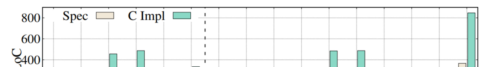

**Specification:** **Fewer LoC compared with C impl**

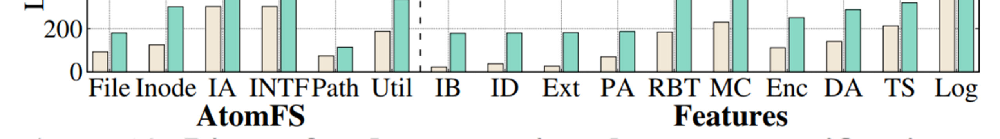

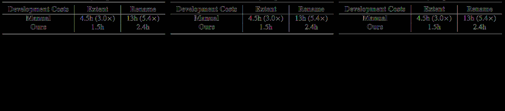

**Improve productivity compared** **with manual implementation** 33

<!-- Page 34 -->

## Summary

- 

**Generative File System: *Sharpen the spec, cut the code*** – Save the effort of file system dev/evo with LLMs

- 

**SysSpec and SpecFS** – Holistic methodology for specifying, constructing, and evolving a file system – **Case study:**Implement**SpecFS**based on**SysSpec**and integrate 10 ext4 features

- 

**Feasibility Validation** – Improve functional correctness of LLM-based code generation – Improve productivity ***Main Page: https://ipads.se.sjtu.edu.cn/projects/specfs* 34

<!-- Page 35 -->


Thanks!


# Q&A

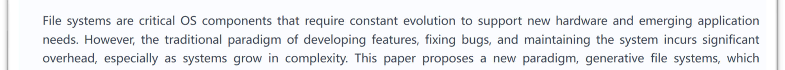


***Main Page: https://ipads.se.sjtu.edu.cn/projects/specfs* 35
